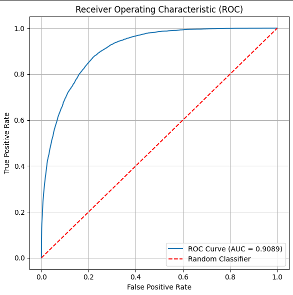

# Model evaluation

In this chapiter, we will learn how to evaluate a model.

## 1. Basic terms

### 1.1  Confusion Matrix and basic stats

A **confusion matrix** is a table that shows how well a `classification model` is performing. It compares 
the `actual labels` with the `predicted labels`.

|1||

| Actual label value     | Predicted Negative label | Predicted Positive label |
|------------------------|--------------------------|--------------------------|
| Actual Negative label	 | TN (True Negative)	      | FP (False Positive)      |
| Actual Positive label  | 	FN (False Negative)	    | TP (True Positive)       |

- **TP**: Correctly predicted positive 
- **TN**: Correctly predicted negative
- **FP**: Incorrectly predicted positive
- **FN**: Incorrectly predicted negative

For example, suppose we have a model that predicts if an email is `spam (1)` or `not spam (0)`. The model tests 10 
emails, and the below two lists represent `actual label(truth)` and `predicted label(model prediction)`:

```text
Actual:    [1, 0, 1, 1, 0, 0, 1, 0, 0, 1]
Predicted: [1, 0, 1, 0, 0, 1, 1, 0, 0, 1]
```

With the above results, we will have the below Confusion Matrix:

| Actual label value   | Predicted: 0 (Not spam)	 | Predicted : 1 (Spam) |
|----------------------|--------------------------|----------------------|
| Actual: 0 (Not spam) | 3 (TN)                   | 1 (FP)               |
| Actual: 1 (Spam)     | (1) FN                   | (5) TP               |

Based on the Confusion Matrix, we can calculate some basic stats:
- **Accuracy**:	How often the model is correct overall.
- **Precision**: When the model predicts positive, how often is it right?
- **Recall**: Of all the actual positives, how many did the model find?
- **F1 Score**: A balance between precision and recall.

#### 1.1.1 Accuracy

**Accuracy** is a numeric value between `0(never correct) and 1(always correct)` that reflects how often the 
model predict a correct label overall. The formula to calculate: **Accuracy = (TP + TN) / All**.

With the above cm example, we can say the model has `accuracy` of `(5 + 3) / 10 = 0.8`. In another word,
My model is correct 80% of the time.

> This value might be misleading if the model is trained with imbalanced datasets
> 
> 
#### 1.1.2 Precision

**Precision** is a numeric value between `0(never correct) and 1(always correct)` that reflects how often the positive
prediction is correct. The formula to calculate: **Precision = TP / (TP + FP)**

With the above cm example, we can say the model has `Precision` of `5/(5+1) = 0.833`. In another word, for all emails
that are predicted as spam, 83.3% were real spam.

> This value is useful when false alarms are costly

#### 1.1.3 Recall

**Recall** is a numeric value between `0(caught nothing) and 1(caught all)` that reflects how often the 
model can catch an actual positive label. The formula to calculate: **Recall = TP / (TP + FN)**

With the above cm example, we can say the model caught `5 / (5 + 1) = 0.833`. In another word, for all emails that are
spam, the model caught 83.3%.

> This value is useful when missing a spam email is costly
> 

#### 1.1.4 F1 Score

**F1 score** is a `harmonic mean value of precision value and recall value`. The formula to calculate F1 score: **2 × (Precision × Recall) / (Precision + Recall)**

With the above cm example, we can say the F1 Score is `2 × (0.833 × 0.833) / (0.833 + 0.833) = 0.833`. 

> The F1 score is very useful when classes in training dataset are imbalanced or you want fair trade-off.
> 
> 

### 1.2 ROC(Receiver Operating Characteristic) Curve

The ROC Curve is a 2D graphe that has two axes:

- X-axis: `False Positive Rate (FPR) = FP / (FP + TN)`
- Y-axis: `True Positive Rate (TPR) = TP / (TP + FN) (also called Recall)`

The below figure is a ROC curve example:



The `red diagonal line`, it represents a random guess(FPR = TPR). We use it to control the
model predictions. 
The `Blue curve` represents the model's performance at a specific classification threshold. In our case, it rises
quickly to the top-left corner of the plot. I


Concept	Description
Perfect Classifier	ROC curve goes straight up to (0,1), then across to (1,1) — AUC = 1.0
Random Classifier	Diagonal line from (0,0) to (1,1) — AUC = 0.5
Better than Random	ROC curve bows toward the top-left — AUC > 0.5
Worse than Random	If below the diagonal, model might be flipping predictions! AUC < 0.5


What is AUC?
AUC = Area Under the Curve

A value between 0 and 1 that summarizes the model's performance

The closer to 1, the better


AUC Value	Interpretation
0.90–1.00	Excellent
0.80–0.90	Good
0.70–0.80	Fair
0.60–0.70	Poor
0.50–0.60	Fail (or random guessing)

When to Use ROC Curve?
Use ROC when:

You care about the ranking of predictions (not raw accuracy).

You have balanced or nearly balanced classes.

If your dataset is highly imbalanced, consider using a Precision-Recall curve instead.

📈 Example Intuition
Imagine a medical test:

A low threshold means you'll catch more real positives (high recall), but also more false alarms.

A high threshold means fewer false alarms, but you might miss actual positives.

The ROC curve shows how your model trades off these two effects.

Want to see an animated example or try building an ROC curve from scratch with toy data?


### 1.3 PR (Precision vs Recall) Curve

## Choose metrics to evaluate a model

The appropriate metrics are important to evaluate a model. There are many factors that we need to consider, such as
the goal of the model(e.g. classification, regression, etc.), the dataset properties(balanced, imbalanced).

### For classification model

In general, we use confusion matrix and related stats such as `Accuracy`, `Precision`, `Recall` and `F1 score` to 
evaluate a classification model.


For balanced dataset, we can also use `ROC Curve` and `AUC value` .
For imbalanced dataset, we can use `Precision-Recall Curve` and `AUC value`


